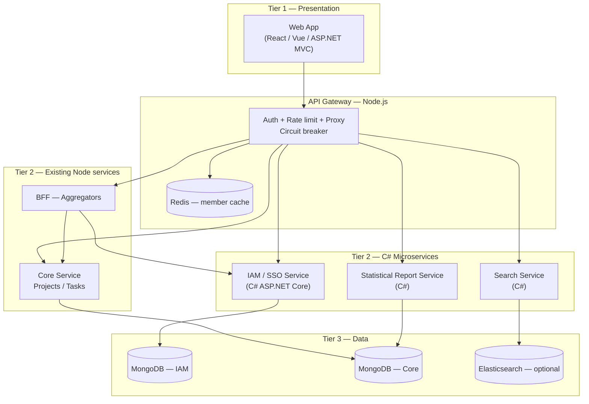
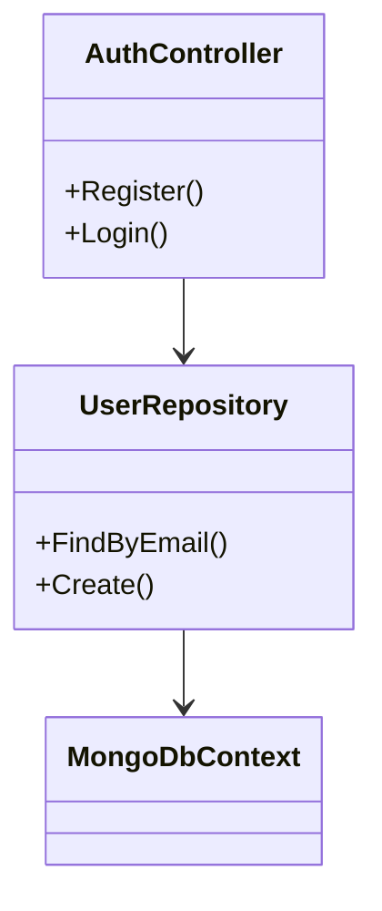
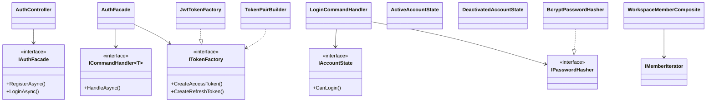
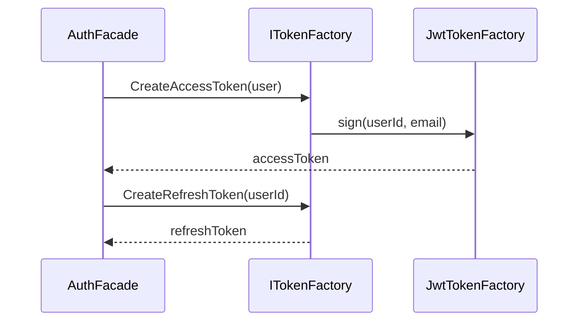
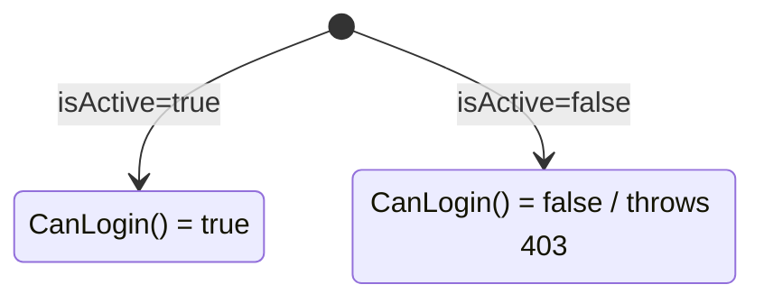

# Architecture Description (AD) — Project & Task Management

## 1. Problem Description

Teams need a **web-based project and task management** system where users authenticate once (SSO/IAM), belong to **workspaces**, and manage **projects**, **tasks**, and related objects. The system must support:

| Function | Description |
|----------|-------------|
| **Login** | Register, login, refresh token, logout, password reset |
| **Managing Users** | Profile, deactivate, workspace membership & roles |
| **Object-Information** | Detail views for User, Workspace, Project, Task (via BFF aggregation) |
| **Search/Find** | Full-text / filtered search across projects & tasks |

**Constraints (course):** Client–Server, **n-tier / Clean Architecture**, **3+ C# microservices**, **5+ design patterns** across CP / SP / BP groups, **Web UI** + **API Gateway**.

---

## 2. System Diagram (Component / Deployment)



**Deployment:** Each service runs in its own process/container; Gateway is the only public HTTP entry (port 3000). IAM listens on **3001** (same contract as Node IAM).

---

## 3. Architect / Styles

| Layer | Style | Implementation |
|-------|--------|----------------|
| **Presentation** | MVC / MVVM | Web SPA + API Controllers |
| **Application** | Use cases, Commands | `IamService.Application` |
| **Domain** | Entities, State | `IamService.Domain` |
| **Infrastructure** | Repositories, JWT, Mongo | `IamService.Infrastructure` |

**Chosen style:** **Clean Architecture** (4 projects) inside IAM; overall system remains **3-tier Client → Gateway/Services → Database**.

---

## 4. Class Diagram — First Design (naive)



*Issues:* fat controllers, no pattern boundaries, JWT logic mixed with persistence.

---

## 5. Class Diagram — Final Design (with patterns)



---

## 6. Design Patterns (5+ per project)

### IAM Service (C#) — implemented in `backend/iam-service-csharp`

| Group | Pattern | Location | Purpose |
|-------|---------|----------|---------|
| **CP** | **Singleton** | `JwtSettingsProvider` | Single JWT config instance |
| **CP** | **Factory Method** | `ITokenFactory` / `JwtTokenFactory` | Create access vs refresh tokens |
| **CP** | **Builder** | `TokenPairBuilder` | Fluent assembly of token pair + persistence |
| **SP** | **Facade** | `IAuthFacade` / `AuthFacade` | Single entry for register/login/refresh |
| **SP** | **Composite** | `WorkspaceMemberComposite` | Tree of members (workspace → members) |
| **BP** | **State** | `IAccountState` | Active vs deactivated login behavior |
| **BP** | **Iterator** | `MemberIterator` | Traverse members without exposing storage |
| **BP** | **Command** | `ICommand` + handlers | Encapsulate login/register operations |

### Search Service (C#) — `backend/search-service-csharp` :3004

| Pattern | Location |
|---------|----------|
| **Adapter** | `MongoCoreSearchAdapter` / `ISearchDataSource` |
| **Facade** | `SearchFacade` |
| **Iterator** | `SearchResultIterator` |

### Report Service (C#) — `backend/report-service-csharp` :3005

| Pattern | Location |
|---------|----------|
| **Factory Method** | `ReportFactory` / `IReportBuilder` |
| **Bridge** | `JsonReportExporter`, `CsvReportExporter` |
| **Command** | `GenerateReportCommand` + handler |

### Web Client — `frontend/web-client` :5173

React + Vite SPA: login, workspace picker, dashboard (BFF), search, reports.

---

## 7. Detail Diagrams (1 pattern each — IAM)

### 7.1 Factory Method — Token creation



### 7.2 State — Account login guard



---

## 8. API Contract (unchanged for Gateway)

Prefix: `/iam`

- `POST /iam/auth/register|login|refresh-token|forgot-password|reset-password`
- `POST /iam/auth/logout`, `PUT /iam/auth/change-password` (authenticated)
- `GET|PUT /iam/users/me`, `GET /iam/users/:id`
- `POST|GET|PUT /iam/workspaces/...`, `GET /iam/workspaces/internal/member-context`

Response envelope: `{ success, message, data }`.

---

## 9. Migration Path: Node IAM → C#

1. Run C# IAM on port **3001** with same `MONGO_URI` and JWT secrets as Node.
2. Point `IAM_SERVICE_URL` in gateway/BFF to C# instance.
3. Retire `backend/iam-service` (Node) after regression tests.
4. Add **Search** and **Report** C# services; register in `SERVICE_REGISTRY`.

---

## 10. Docker (one-command run)

```bash
cp .env.example .env
docker compose up --build
```

Open **http://localhost:8080** (web → nginx → api-gateway → microservices).

---

## 11. Skeleton Program Structure

```
iam-service-csharp/
  src/IamService.Api/           Controllers, Middleware, Program.cs
  src/IamService.Application/   Facade, Commands, DTOs, abstractions
  src/IamService.Domain/        Entities, State pattern
  src/IamService.Infrastructure/ Mongo, JWT, BCrypt, DI
```

See source under `Patterns/` folders for class-level skeletons referenced in class diagrams.
